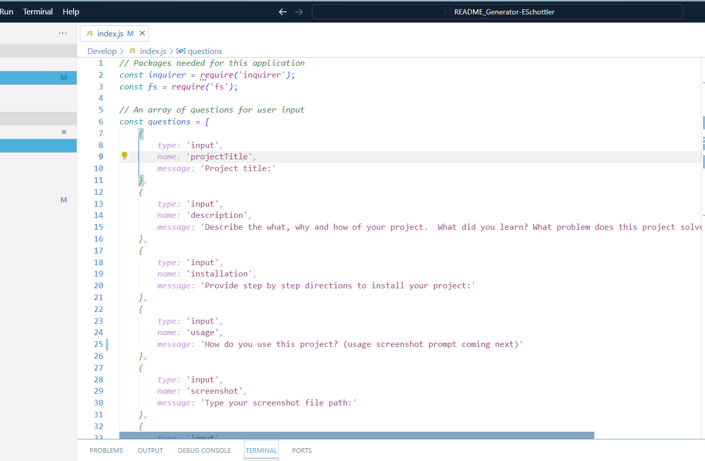

 # demo
 

 ## Description
 
 We did lots to solve lots of problems.
 
 ## Table of Contents
 
 - [Installation](#installation)
 - [Usage](#usage)
 - [Contributing](#contributing)
 - [Tests](#tests)
 - [Questions](#questions)
 - [License](#license)
 
 ## Installation
 
 Go to the terminal and run node.js.  answer the prompts.  Be sure to use a project title appropriate for a file name.
 
 ## Usage
 
 Run it each time you need a readme for a new project

 
 
 ## Contributing
 
 Ellysa SChottler, https://github.com/ellysaschottler
 
 ## Tests
 
 N/A
 
 ## Questions
 
 If you have any questions about this application, please reach me at fakeemail.gmail.com.  You can also find my GitHub profile at https://github.com/ellysaschottler
 
 ## License
 
 This application is covered under 'MIT License'

 