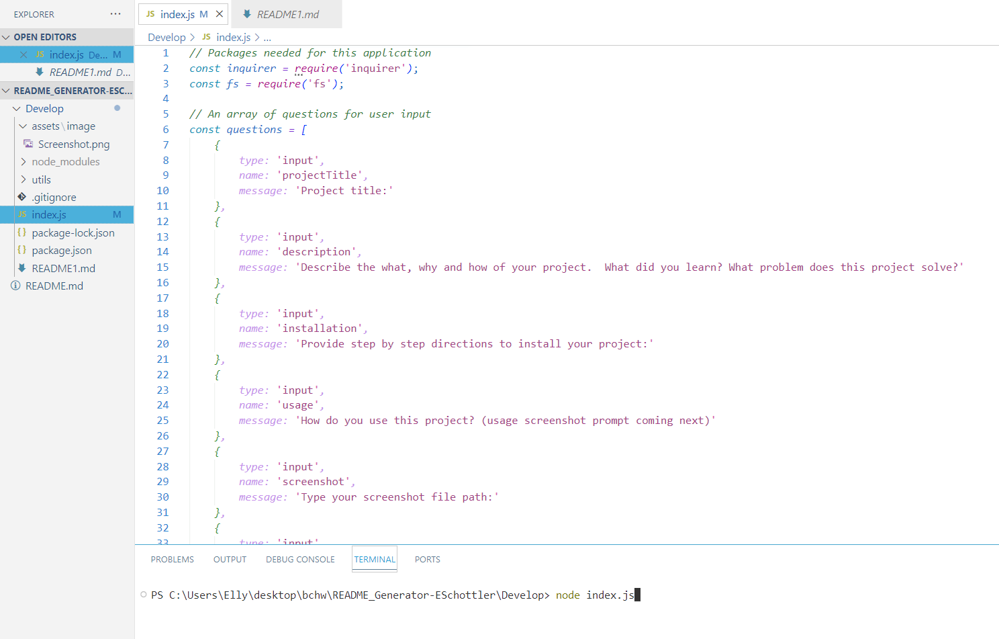

 # README_Generator-ESchottler
 

 ## Description
 
 This project takes user input and creates a README.md with the input.  This solves the problem of rewriting similar code over and over again for all the README files you will need to create.
 
 ## Table of Contents
 
 - [Installation](#installation)
 - [Usage](#usage)
 - [Contributing](#contributing)
 - [Tests](#tests)
 - [Questions](#questions)
 - [License](#license)
 
 ## Installation
 
 To install this application, run ‘npm init -y’ in the terminal. Then run ‘npm i inquirer@8.2.4’ in the terminal.
 
 ## Usage
 
 After installation, type “node index.js” in the terminal and answer the prompts. 

 
 
 ## Contributing
 
 Ellysa Schottler - https://github.com/ellysaschottler, Starter code: https://github.com/coding-boot-camp/potential-enigma 
 
 ## Tests
 
 N/A
 
 ## Questions
 
 If you have any questions about this application, please reach me at <fakeemail@gmail.com>.  You can also find my GitHub profile at <https://github.com/https://github.com/ellysaschottler>
 
 ## License
 
 This application is covered under MIT License

 
